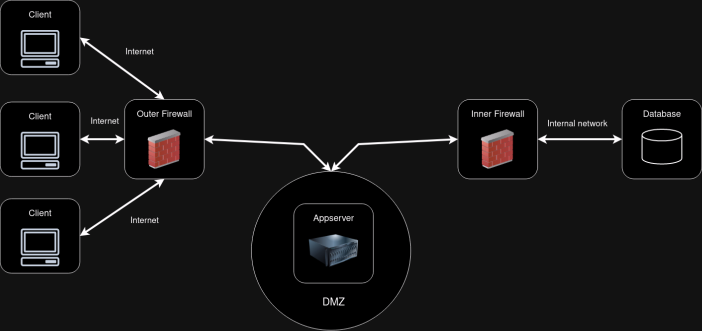
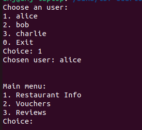
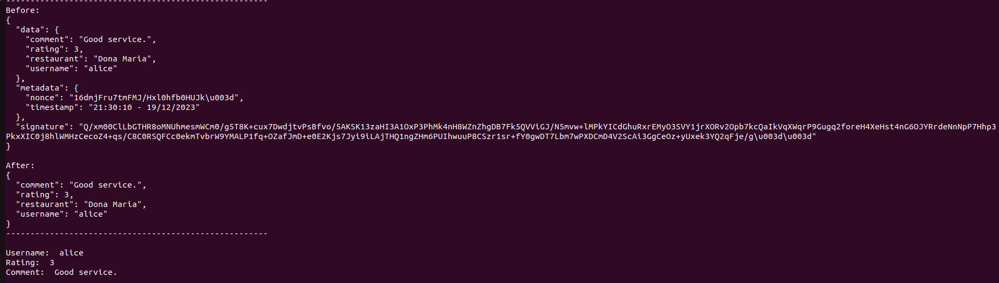
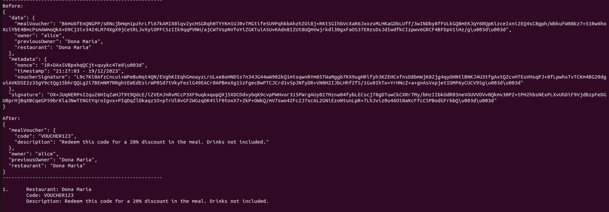
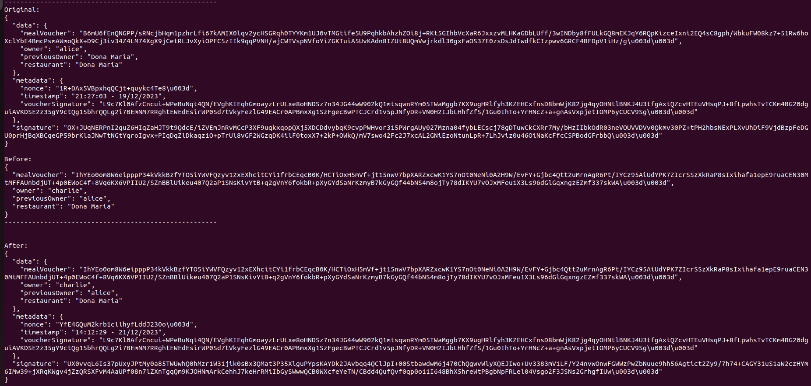

# T57 BombAppetit Project Read Me


## Team

| Number | Name              | User                                    | E-mail                                        |
|--------|-------------------|-----------------------------------------|-----------------------------------------------|
| 96857  | Duarte Jeremias   | <https://github.com/duartejeremias>     | <mailto:duarte.jeremias@tecnico.ulisboa.pt>   |
| 96909  | Rodrigo Liu       | <https://github.com/RodrigoSLiu>        | <mailto:rodrigoliu@tecnico.ulisboa.pt>        |
| 105741 | Francisco António | <https://github.com/franciscojaantonio> | <mailto:francisco.antonio@tecnico.ulisboa.pt> |

  

## Contents

This repository contains documentation and source code for the *Network and Computer Security (SIRS)* project.

The [REPORT](REPORT.md) document provides a detailed overview of the key technical decisions and various components of the implemented project.
It offers insights into the rationale behind these choices, the project's architecture, and the impact of these decisions on the overall functionality and performance of the system.

This document presents installation and demonstration instructions.


## Installation

To see the project in action, it is necessary to setup a virtual environment, with N networks and M machines.  

The following diagram shows the networks and machines:



### Prerequisites

The virtual machines are based on: Ubuntu 22.04 and Kali 2023.3.  

[Download](https://cdimage.kali.org/kali-2023.4/kali-linux-2023.4-virtualbox-amd64.7z) and [install](https://www.kali.org/docs/virtualization/) a virtual machine of Kali Linux 2023.3.  
Clone the base machine to create the other machines (Gateways).

[Download](https://ubuntu.com/download/desktop/thank-you?version=22.04.3&architecture=amd64) and [install](https://ubuntu.com/tutorials/how-to-run-ubuntu-desktop-on-a-virtual-machine-using-virtualbox#1-overview) a virtual machine of Ubuntu 22.04.  
Clone the base machine to create the other machines (Server, Client and Database).

### Machine configurations

For each machine, there is an initialization script with the machine name, with prefix `init-` and suffix `.sh`, that installs all the necessary packages and makes all required configurations in the a clean machine.

Inside each machine, use Git to obtain a copy of all the scripts and code.

```sh
$ git clone https://github.com/tecnico-sec/t57-duarte-rodrigo-francisco.git
```

### For the specific details of each machine, access the following directory

#### [Machines Setup](./setup)

## Demonstration

Now that all the networks and machines are up and running, lets get a preview of what some possible use cases are.



When the client starts, he gets to choose with which user to perform the following requests. This is a simple abstraction of
what a possible login system would be, where different users have different ownerships and access to separate resources.

In the image, the user chose to make the following requests as Alice, therefore, he will only have access to Alice's vouchers, for example.

We can also see what the main menu looks like, how the user can navigate it, and what possible resources can be accessed

If the client types **3** for the reviews menu, and then **2** for the **List reviews** command, he will be asked for which
restaurant does he want the reviews from.

After picking reviews for **Dona Maria**, one of the reviews returned is like this:


We can see the before, ie, what the server returned straight from the database. This being the protected data. In this case,
the review does not require encryption, so its in plaintext, but we can see our other security measures.

The client app automatically checks the json for any evidence of tampering, by checking the signature with the public key of the
user who created the review, which in this case is alice.

Therefore, we get assurance of the review being non-repudiable.

After checking that the information has not been tampered, the client app automatically unprotects it into what's shown in 
the after json, which we print in a prettier manner just bellow it

If in the main menu we had chosen the 2nd option, to access the Vouchers menu, and choose to list them, only the chosen users 
vouchers (this case being alice's) will be chosen:



In this picture we see one of the said vouchers.

Now, in the before segment, we can see that the mealVoucher is actually encrypted with alice's public key, therefore, only her
can unprotect it as shown in the after segment.

We can also see that the voucher's metadata now contains a new field, **voucher signature**, this signature was made by the issuing restaurant's private key of the mealVoucher
before it was encrypted for alice, this allows the client to check both the entire json as whole for tampering, as well as the specific unencrypted voucher.

If we now choose to transfer a voucher, lets say, to charlie, the output would look like this:



The **Original** segment contains the protected voucher in its original form, still belonging and encrypted for alice.

The **Before** segment contains only the altered data for chalie, ie, the voucher was unencrypted by alice, using her private key
and encrypted for charlie, using his public key, as well as changing the owner from alice to charlie, and the previous owner from Dona Maria to Alice

The **After** segment shows us what will be stored in the database, the updated voucher, where the voucherSignature remains the same,
the encrypted mealVoucher changed for charlie's eyes only, and the signature, now made with alice's private key, also changed.

For an attacker to try and access the encrypted information, he or she would need access to the user's private key, all other data
is public and therefore does not require encryption.

If a tamper attempt is made, the check command will detect it.

This concludes the demonstration.

## Additional Information

### Links to Used Tools and Libraries

- [Java 11.0.16.1](https://openjdk.java.net/)
- [Maven 3.9.5](https://maven.apache.org/)
- [Flask](https://flask.palletsprojects.com/en/3.0.x/)
- [MongoDB](https://www.mongodb.com/)
- [Python Requests](https://pypi.org/project/requests/)

### Versioning

We use [SemVer](http://semver.org/) for versioning.  

### License

This project is licensed under the MIT License - see the [LICENSE.txt](LICENSE.txt) for details.
