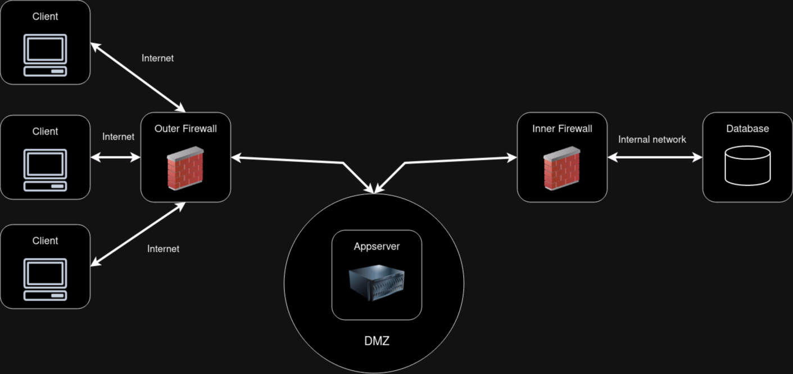

# T57 BombAppetit Project Report

## 1. Introduction


The Restaurants & Tourism scenario, BombAppetit, revolves around creating a web application to enhance the dining experience
of the BombAppetit customers.

The core data being handle is composed by:

- restaurant general info
  - owner
  - name
  - address
  - genre
  - menu
- vouchers
  - code
  - description
  - owner
  - previous owner
  - restaurant (to use the voucher in)
- reviews
  - rating
  - comment
  - user
  - restaurant

The restaurant Info contains any info that may be of interest to the client. The vouchers allow the customers who have them
to get special discounts and rewards for being a loyal customer. The reviews allows the costumer to get a feel of what other
costumers thought of the restaurant before going.

To aid in the creation of this application, we designed and developed a secure document format and a cryptographic library 
that provides Confidentiality, Integrity and Authenticity to the data being transferred between the actors in the network.

Regarding the network infrastructure, we decided that a DMZ between the client and the database VM, with the AppServer VM in the middle,
would be the best option.


The client uses the SecureDocument class through console commands.

## 2. Project Development

### 2.1. Secure Document Format

#### 2.1.1. Design

In the design stage of our cryptographic library, we quickly came to the conclusion that we only needed Confidentiality
to protect the vouchers. The Restaurant Info, being public knowledge, as well as the reviews, do not require encryption to be shared.

However, we still assure both Authenticity and Integrity to everything being sent in the network.

Therefore, our cryptographic CLI tool, which we named `secdoc`, has the following commands:

- `protect`, that:
  - if used on a voucher, provides Confidentiality, Integrity and Authenticity
  - if used on the restaurant info, provides Integrity and Authenticity
- `check`, that checks if a file has been tampered with or if it has lost freshness
- `unprotect`, that removes all the protection of a file


This is an example of a voucher, in its JSON format, after being created by the issuing restaurant

```json
{
  "mealVoucher": {
    "code": "VOUCHER123",
    "description": "Redeem this code for a 20% discount in the meal. Drinks not included."
  },
  "owner": "alice",
  "previousOwner" : "Dona Maria",
  "restaurant": "Dona Maria"
}
```

After running `protect --voucher <dona maria's private key to sign with> <alice's public key to encrypt with>` on this document, the resulting file would be:

```json
{
  "data": {
    "mealVoucher": "LdMbfJP1wJcB7HmwK01mJX7LdObrIhQplbUrN37UKMvz7ENJsRChi2Ll2YSFYFz4kqo5BZRvi8fiiZf/OfyPThq61tGHBnvpnjjnWjk84eZZUNEnnMVuGe33jLYPMSxYQf6Uiscab0ut1PksfXEPqc3YE7N7P+loLxH/7Sz84xOVEMTS4SM1q7WPpv1j84PVIHgX7skb9EvTL5QG3Drm7Xx/RV2oDQ9nw2uXvH8Zz78E3iY8X8gkVL3vS07YAV7iMFb6QbdenxBbg/HY+VpH9P5ACdLSZHvfrVliYJ4IY+ZCMOS9Q2Aa2tVKkuE+xGSfJQvtVpQWNbv8vrVlKz5xzg\u003d\u003d",
    "owner": "alice",
    "previousOwner": "Dona Maria",
    "restaurant": "Dona Maria"
  },
  "metadata": {
    "nonce": "xzY+a2iSS9hOT5TQiNUIjWnUp3c\u003d",
    "timestamp": "18:15:22 - 18/12/2023",
    "voucherSignature": "XoQ3WlsFvPHwyiZ8gxEbRDWdQ4VtQfIejuSIX5F5/gJcA+mVE7se8zvJlFwhpS5F0YclH8BbHSc0IJO+uZzrO7UpJaWSzEPvbszCl2NifgC4XDjyYzZF8anPpayrjK+WtIo248G3xUAbswWpjitC0HQp+EEuuOisVdeg/lUp8waaf2wq6C2oES71angpVZSedffLa3jskJveXH92dqzs15Aocy8BT1eIptj/azQ0GQ7mI1IMLkQzN0Su367HzJCOYJXQIX3tX8aqi8TN34lkc7X0Bswiok++94uNrBC4Jjtb04IusTpfkOMBUwO8utnshRuZR3/7vX+XsfjUgSnkkA\u003d\u003d"
  },
  "signature": "RhB5HFHHPgx6wqoQv3RHbYEd0FYlDopTEFiTRMhvTGRDNMzrh8UriNr/UkhFohwaMRUwItUg+Ma+DTjIsE5LGd7BY5HLd5zW8N1qcDoMVoqnLh0FtfAhCOE12Bt/1u8SA3rMmN4Qk9hIdDkQC00q0XXjf8U5j4xYHos1pXM+V1k3FdU5BlxXSHee8j+M+OI9W8oydZRgY+eAgmqs54xw4j8d7XqFw147OR1NZvENxANnU54KvJyJsxZ3i7MDaznwxwMf3fzdz7sLR2tEzoSH26c1LU1GkaDygSjIDb+dOGwBpIvBCcEfWRqUhgENRlqIpDRYKnE+SvAHqTniVNlt/Q\u003d\u003d"
}
```

For the voucher, we made a protection 'sandwich' that works in the following steps:

1. tool gets the `mealVoucher` object and makes a signature of it, using the issuing restaurant's private key (in this case, Dona Maria's)
2. then, the `mealVoucher` object, which is where the secret contents that must be encrypted reside, gets encrypted using the `owner` public key (in this case, Alice's)
3. the tool gets the json object, which now contains an encrypted `mealVoucher`, and encapsulates it as `data` in the final json 
4. the tool then adds a `metadata` property to the final json, where it adds the `nonce` and `timestamp` used to check the freshness, as well as the unencrypted `mealVoucher` `voucherSignature`
5. in the end, the tool uses the `data` and `metadata` to create a final `signature`, made with the `previousOwner` private key, which in this case, is Dona Maria`s private key since its when the restaurant first issues the voucher

By adding the protection, for the voucher, in this manner, we get assurance that nothing in the voucher can be tampered, and the owner of the
voucher can freely and directly transfer it to another user.

If the user, in this case, Alice, decided to transfer the voucher, the `protect` command would be executed like this:

`protect --voucher -t <new owner's public key to encrypt with> <current owner's, which will become the previous owner, private key> <original protected voucher> <unpprotected voucher>`

(the unencrypted voucher already has the `owner` field set to the new owner, and the `previousOwner` field set to Alice)

this command will:
1. get the unencrypted `mealVoucher` from the unprotected voucher, which alice unencrypted using her private key, and encrypt it using the new owner's key
2. then will set the `data` field with the newly encrypted `mealVoucher`, as well as it's new attributes (`owner` and `previousOwner`)
3. the tool then adds a `metadata` property to the final json, where it adds the `nonce` and `timestamp` used to check the freshness, as well as the `voucherSignature` which came from the unprotected voucher
4. in the end, the tool uses the `data` and `metadata` to create a final `signature`, made with the `previousOwner` private key, which in this case, is now Alice`s private key since its her that transferred the voucher to the new owner

By protecting the voucher this way, we can always be sure that the unencrypted `mealVoucher` won't be tampered, since we always carry over the original signature made by the restaurant,
and we also be sure that the encrypted 'mealVoucher', as well as the remaining data isn't tampered, since the `previousOwner` always signs the overall json.

Another example, this time of the restaurant Info

```json
{
  "restaurantInfo": {
    "address": "Rua da Glória, 22, Lisboa",
    "genre": [
      "Portuguese",
      "Traditional"
    ],
    "menu": [
      {
        "category": "Meat",
        "currency": "EUR",
        "description": "A succulent sirloin grilled steak.",
        "itemName": "House Steak",
        "price": 24.99
      },
      {
        "category": "Fish",
        "currency": "EUR",
        "description": "A Portuguese staple, accompanied by potatoes and salad.",
        "itemName": "Sardines",
        "price": 21.99
      },
      {
        "category": "Vegetarian",
        "currency": "EUR",
        "description": "Creamy Arborio rice cooked with assorted mushrooms and Parmesan cheese.",
        "itemName": "Mushroom Risotto",
        "price": 16.99
      }
    ],
    "owner": "Maria Silva",
    "restaurant": "Dona Maria",
    "username": "Dona_Maria"
  }
}
```

After running `protect --info` on this document, the resulting file would be:

```json
{
  "data": {
    "restaurantInfo": {
      "address": "Rua da Glória, 22, Lisboa",
      "genre": [
        "Portuguese",
        "Traditional"
      ],
      "menu": [
        {
          "category": "Meat",
          "currency": "EUR",
          "description": "A succulent sirloin grilled steak.",
          "itemName": "House Steak",
          "price": 24.99
        },
        {
          "category": "Fish",
          "currency": "EUR",
          "description": "A Portuguese staple, accompanied by potatoes and salad.",
          "itemName": "Sardines",
          "price": 21.99
        },
        {
          "category": "Vegetarian",
          "currency": "EUR",
          "description": "Creamy Arborio rice cooked with assorted mushrooms and Parmesan cheese.",
          "itemName": "Mushroom Risotto",
          "price": 16.99
        }
      ],
      "owner": "Maria Silva",
      "restaurant": "Dona Maria",
      "username": "Dona_Maria"
    }
  },
  "metadata": {
    "nonce": "QWb07uRZtViyC4lmhHvC9I2oyXo\u003d",
    "timestamp": "18:07:03 - 18/12/2023"
  },
  "signature": "WwwQcGD0qNoOSVfxRRu70ATh6ILkALuUxhbcia8K3wY9gX6+In0j7Y2I4mhaPCcH4cCU9Mt2L5u2uUiBoivaDrGDMjpnr++WsmhFcof7XMocUjldnos/9o6UhykrvpnoKqlH9JwziZUo2WeYzKb9/punWBPJndJFl3bt2AeFy5XblgL+e5ZYCL1axwVPSz7WQ9WAw/ap4U0Tb2GQs0VdqnZR5A2JdDdHrXiPHUeZ9Q5WTakFfQyTYXs5jTUtx9ozXwbP6DZH4apmHIdYgWdq3IKSG4Ec6JHRmW/K8Ci0Xo5Cko19KPSXosAoc6d+aYDgqIS8bmDfBKKhCmwxU0r1vw\u003d\u003d"
}
```

Finally, for the review protection

```json
{
  "comment": "Good service.",
  "rating": 3,
  "restaurant": "Dona Maria",
  "username": "alice"
}
```

After running `protect --review` on this document, the resulting file would be:

```json
{
  "data": {
    "comment": "Good service.",
    "rating": 3,
    "restaurant": "Dona Maria",
    "username": "alice"
  },
  "metadata": {
    "nonce": "Uiok9D3tNnoyLDoP9fmRTnu9vKE\u003d",
    "timestamp": "18:08:16 - 18/12/2023"
  },
  "signature": "OsTYcXFZGwG8Z9FH/YDMNw284rGw/Ea1pt3zUaYtIFbo7HDkW4GxXD3AnoztkaU03S9rgmG7lUcBoWR5PgWTGuBAjz/2fggus9igf10rg7HH77jVqgSbBLjoOMB1AP+QWF/k0ExOD+5/dimNGighHZSTEEk/MH/rPJ+4dQ6/EaH1QlhLRK4cus0ODpXVyO4t8/xZxiDEhOr2o3PdIBwOWr/srBNpZ3Eyb6lJSfswmKKrxWCi3sik0ok1YFrK4gs8vdT5b1niRTxT9dZEHu9tcqVldNk3dCeytk78OU5rSqMeptPraGL4TuwfXPtJQeIo2DiRLks4D0WcPeUY00GzOA\u003d\u003d"
}
```

#### 2.1.2. Implementation

We decided to use Java, and It's `java.security` cryptographic library.

Therefore:
- To assure Confidentiality, in this case, only of the voucher, we decided on an `RSA/ECB/PKCS1Padding` cipher, that uses the `owner` public key as a key.
- To assure Integrity, we decided on using both a timestamp and a nonce value.
- To assure Authenticity, we decided on using adding a `SHA256withRSA` Digital Signature that uses the specified in the command private key as a key
  and signs a `SHA-256` digest of the whole file.

Regarding the signature and the encrypted data, we base64 encoded it to be able to include it in the JSON.

The only major challenge we encountered was on updating the original specifications to work with the released security challenge.

This was especially challenging on the Voucher protection, where we spent a lot of time to think of an appropriate means of protection

### 2.2. Infrastructure

#### 2.2.1. Network and Machine Setup

After reviewing the possible options for a network infrastructure, we decided that implementing a DMZ would be the best choice.

For this DMZ, we require 4 virtual machines:
- one acting as a Database;
- one acting as the application server;
- one acting as the outer firewall;
- one acting as the inner firewall.

Setup as shown in this image:



For the database machine, we are running a mongoDB database. We quickly came to the conclusion that a NoSQL database would
be best for this scenario to ease our constant iterations through what we should store, and how.

For the appserver, we decided to use Python and Flask, since we all already had previous experience building APIs with it.

For the clients, we built a simple Python script for a CLI to let the users easily make requests through simple commands.

#### 2.2.2. Server Communication Security

The security of communications with the server is ensured by the existence of valid certificates in any of the communication parties.

We're using Flask for our server. In Flask, the ssl_context parameter can be used to enable secure communication with the server by specifying the SSL/TLS context. This is important because we need to ensure the use of HTTPS to encrypt the data transmitted between the client and the server.

To use ssl_context, we need to generate a Certificate and a PrivateKey for the server.

We already have the tools to generate key pairs, it's quite straightforward, but what about certificates?

##### 2.2.2.1. Getting Certificates

We started by generating a Certificate Authority that is trusted by everyone in the system. When the CA is created, it generates its own certificate which is signed by itself and then distributed to all participants in the system.

Each participant can then generate their Certificate Signing Request (CSR) and share it with the CA. If the latter finds no irregularities in the CSR, it will generate a Certificate for it.

Each user then has to share their certificate with the others. All participants are then in possession of the certificates of the others, as well as the certificate of the CA itself (responsible for generating all the certificates).

This way, before trusting any of the other users' certificates, they can check their validity with the support of the CA's certificate.

Once we've verified that a certificate is indeed valid, we can extract the respective participant's public key from it, knowing for sure that the key really belongs to them.

In our implementation, whenever a distribution is made, whether it's CSR or Certificates, it is done manually.

##### 2.2.2.2. Server and Client Configuration

Now that we have the server's certificate and private key, it can start operating securely.

In Python's requests library, the verify parameter is used to specify whether to verify the SSL Certificate of the server when making an HTTPS request. The SSL Certificate is used to establish a secure connection between the client and the server, ensuring that the communication is encrypted and secure.

By specifying the CA's certificate (which we trust and hold) in the verify parameter, we can check the validity and security of that communication and whether we can really trust that server's communication.

##### 2.2.2.3. Initial keys and their distribution

According to our scenario, we could have considered that at the beginning the user and the service share their respective public keys.

After we developed the entire certificate system (mentioned above), this assumption became irrelevant because now all participants in the system can share their certificates, validate them and obtain the necessary public keys securely.

In our solution:

1. The Certificate Authority is created and its certificate is placed manually on all the other machines.

2. Each user then generates their CSR which is then signed by the CA that return the certificate for that participant.

3. All the certificates are then placed manually on each machine, so that each user can check them and extract their public key from them

4. After this, each participant has all the necessary public keys and the system is ready to start.

> As discussed in class with the professors, when the client script begins executing, it already possesses all the other users public keys, certified and trusted previously by the CA to facilitate the demonstration in class.

### 2.3. Security Challenge

#### 2.3.1. Challenge Overview

For the security challenge, we were tasked with three new requirements:

- Add `Reviews`, with at least classification and some text, which must be non-repudiable and that other users must be able
to verify the authenticity of each review, to ensure credibility and trustworthiness in user feedback;
- Add the ability for users to **directly** transfer vouchers between each other;
- Add the ability for users to use their vouchers.

This new requirements majorly impacted our initial view of the project and implementation of the cryptographic tool. Originally
we made everything to go from the client to the server, and vice-versa, so for example, the keys supplied to the tool were always
either of the recipient of the document or of the sender.

Now, where we must beware that a user needs to be able to check other user's reviews authenticity, as well as transfer vouchers directly 
between them. 

So it was clear that we needed a key sharing mechanism.

#### 2.3.2. Attacker Model

The server is now **partially trusted** since it now only transfers data from the database to the user. It does not sign
anything with its own keys.

The CA is **fully trusted** because it is responsible for signing the CSR of all users. It is the root of our public key distribution system.

The users are **partially trusted** since they can contact the server and get resources, which they have access to, from the database.

Everyone else is **untrusted**.

The attacker, in this model, is only powerful if he gets access to the users private keys and use them to unencrypt the
vouchers.

Even then, the attacker can only use the voucher if he sends the request as the owner of the voucher.

The rest of the data, this being the reviews and the restaurant info, are public by default.

Other than that, if the user attempts to tamper any of the data in any way, will be detected.

#### 2.3.3. Solution Design and Implementation

As explained previously, we added a CA that we used to sign and verify all the certificates, before sharing them.

Since we now can assume that every user knows the public key of the other users, we changed our original implementation of the secure tool to receive additional arguments corresponding to the keys that the tool requires, depending on the command.

We also additional data to the jsons being transferred:

- in the reviews, we added the `user`, which allows the other users to know who made the review and, therefore, to pick
the correct key to verify its signature;
- in the restaurant info, we added the `username`, which corresponds to the restaurant owners account that we created only to sign
its own info and any vouchers that they may create
- in the vouchers, we added the `owner` and `previousOwner` attributes, which allows the users to both transfer, view and use their vouchers
by using the correct combination of keys to verify the information.


## 3. Conclusion

In conclusion, we created a possible business solution to the BombAppetit project scenario. With a proper infrastructure of VMs and firewalls,
proper secure communications through HTTPS and proper data Confidentiality, Integrity and Authenticity using our own proprietary
secure tool developed in Java.

We also took this chance to learn how MongoDB databases work.

Requirements:
- Secure Documents: **satisfied**
  - Our tool is fully capable of providing proper assurance of data Confidentiality, Integrity and Authenticity
- Infrastructure
  - VM network and firewalls: **partially satisfied**
    - We managed to build our DMZ network, however, we could not correctly implement adequate firewall rules in time.
  - Secure Communications: **satisfied**
    - We managed to create an entire mechanism for certificates, allowing them to be created, validated and used to obtain the respective public key.
    - This way, the server can start operating securely, as already explained, and clients always have the chance to verify it.
    - We consider this to be a perfectly reasonable implementation.
- Security Challenge: **satisfied**
  - We think our solution to the proposed security challenge and requirements is perfectly viable.

Regarding future enhancements, we propose a proper browser interface to allow the users to interact with the application.

We also propose implementing a proper system of login authentication for the users by taking advantage of OAuth2 and third-party
token providers.

### Concluding statement

This project has been hugely important and crucial to our development and training as engineers, it not only allowed us to learn
how to build a secure application from top to bottom, while providing adequate security, as well as providing us a new appreciation
of the technologies that we use daily, and how they work, securely, more often than not.

## 4. Bibliography

[MongoDB documentation](https://www.mongodb.com/docs/)

[Flask documentation](https://flask.palletsprojects.com/en/3.0.x/)

[Requests documentation](https://requests.readthedocs.io/en/latest/)
